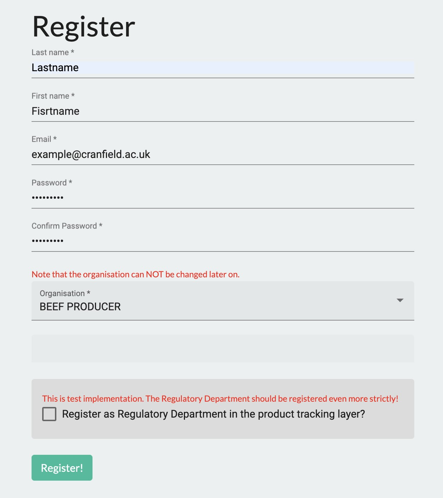
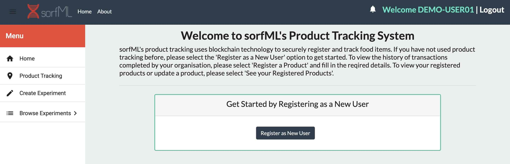
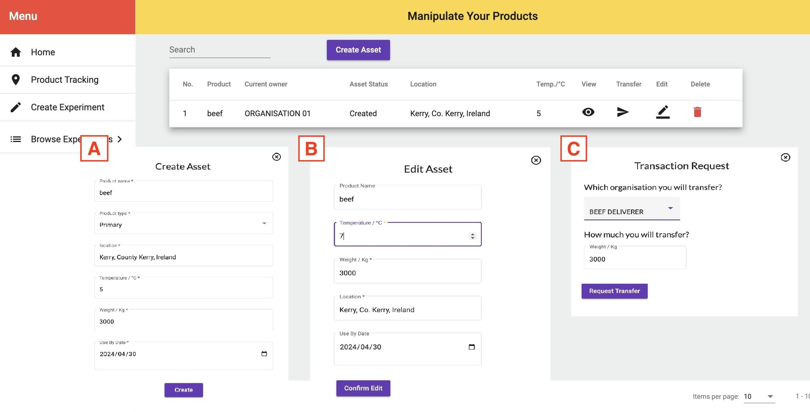
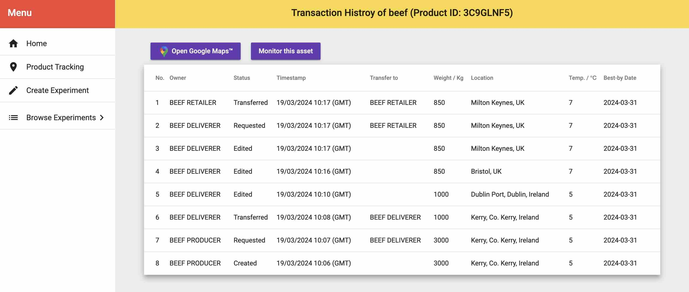
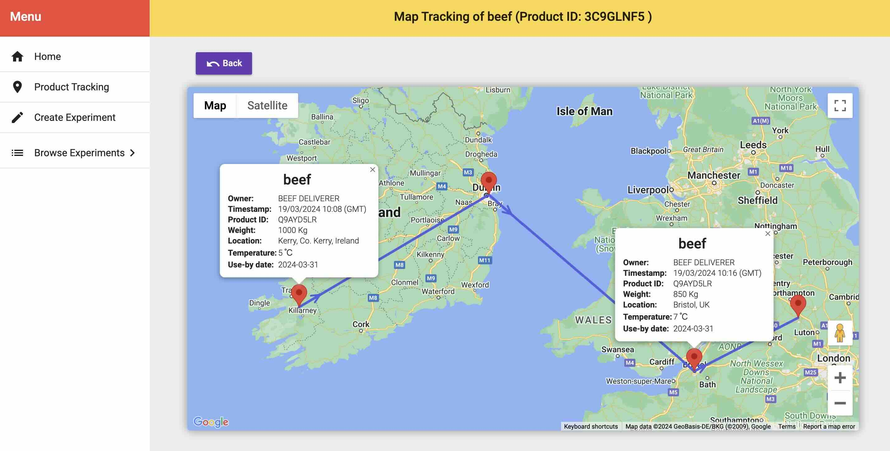

# sorfML3.0

  
  
  
  
  
  
  
  
  
  

  

Ensuring safety and quality of food whilst also meeting high consumer demand is a great challenge in the food industry. Maintaining standards requires food business operators to adhere to strict regulations and testing, though current testing methods are known to be inefficient, expensive and produce retrospective results. Furthermore, transparency and traceability of products is known to be a weak link within the food supply chain. As a result, digital technologies have now started gaining popularity in an effort to improve on these issues. The use of non-invasive analytical technologies in combination with machine learning has recently gained popularity as an efficient alternative for assessing the quality of foodstuffs. Analysis of analytical data is more complex, therefore the sorfML platform was originally developed as a user-friendly web application to determine the most suitable machine learning algorithms for predicting spoilage or authenticity using analytical data. This project has built on the sorfML functionalities with the addition of a new product tracking system to address the lack of traceability across the agri-food supply chain.

## User manual (general registrations)

### Registration to the system

If you are new to sorfML, I need to create your own account - when accessing the home of sorfML, complete the registration by entering 1) last name, 2) first name 3) email address and 4) organisation name you belong to. If you want to register yourself as a Regulatory Department role, which monitors transaction requests and gives approval in the product tracking layer, please check the checkbox "Register as Regulatory Department". 

✅ NOTE that the organisation name cannot be modified later on. Therefore, please make sure that you enter the proper name of organisation. If you cannot find your organisation from the pull-down list, please set "Others" and then you can manually enter a new organisation name.

### Registration to the product tracking layer

Once you finish the regstration, you can also register to the product tracking layer - click the "Product Tracking" button on the main menu, and click the "Register as New User" button below. If the resistration is successfull, you can join a newtwork of Blockchain for product tracking.

## User manual (the machine learning ranking layer)

The user manual for ML raking layer will be put here.

Please visit <a href="https://github.com/FadyMohareb/sorfml3.0/tree/main/testData">https://github.com/FadyMohareb/sorfml3.0/tree/main/testData</a> to see several example experimental data files (Enose_data.csv and HPLC_data.csv).

Please visit <a href="https://github.com/FadyMohareb/sorfml3.0/tree/main/testData">https://github.com/FadyMohareb/sorfml3.0/tree/main/testData</a> to see an example metadata file (Bacterial_Counts.csv).

## User manual (the product tracking layer)

Before starting, please make sure you have already resister to the product tracking layer to join a nwtwork of Blockchain.

### Create a new asset

You can create and regster your food product asset - go to the main section and click the button "Create Asset". Then you can enter 1) product name, 2) product type, 3) location, 4) temperature, 5) weight and 6) use-by date (see subcaption A in the figure below). If it is successful, your asset is now regstered onto the product tacking system of sorfML. 

### Edit your assets

You can edit your own asstes by clicking the "Edit" button (see subcaption B in the figure below). Note that if you change the product name, its product type is automatically changed into "Derived". In addtion to that, you can manipulate all the asset which belong to your oraganisation, even though they are registered by other users.

### Transaction request

If you attempt to transfer your assets to another organisation, you  need to send a transaction request to Regulatory Department of sorfML system. By clicking the button "Transfer", you can enter an organisation to which you attempt to transfer your asset, and the amount of the transferred asset (see subcaption C in the figure below). Note that your asset is NOT transferred yet at this moment because your transaction request needs to be approved by a Regulatory Department.

### Transaction records

You can monitor transaction history of your assets - go to "See Transaction History" section from the home of the product tracking layer, then a list of assets which belong to your organisation will pop by. Click the "View" and "See Transaction History" button. And you will acquire the whole history on the blocks of the asset.

### Download QR codes

In the "See Transaction History" section, a QR code which records the current status of the asset can be downloaded by clickling the "Download QR Code" button. Note that the QR codes do not contain the whole records of the asset transaction history.

### Geographical visualisation with Google Maps™

If your assets have already been transferred throughout different locations, the "Open Google Maps™" section provodes you with a geographical visualisation of your assets' transactions on Google Maps™. Each pin shows the block information at the point as its asset status.

## Queries, issues and reports

If you have any inquiries, requests for new functionalities, reports on errors, or concerns related to the most recent release of sorfml3.0, kindly utilise the <a href="https://github.com/FadyMohareb/sorfml3.0/issues">issues</a> section positioned at the upper-left corner of the GitHub repository.

